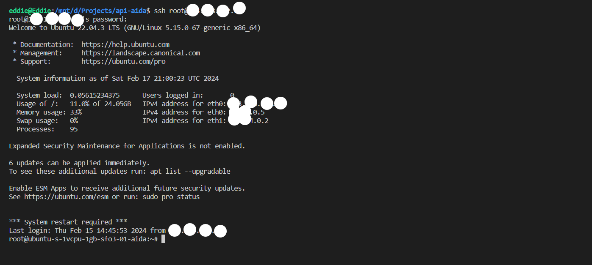
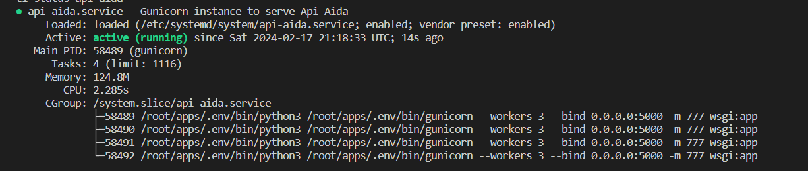

# Deploying Flask App in Digital Ocean Droplet


Recently, I read a blog post about customizing APIs from Gemini Models, but when I tried following the instructions, everything got stuck at localhost:5000. Basically, my apps were only visible on my computer. So, I went on a quest to figure out how to make it accessible to everyone. That's when I learned about deploying Flask apps on a Digital Ocean droplet. This guide is like a map to help you do the same, so your projects don't get stuck at localhost:5000 either. Let's share your awesome creations with the world! ✨ It's time to unleash them onto the global stage by mastering the art of deploying Flask applications on a Digital Ocean droplet or any **Ubuntu Server.**

---
Step by step  guide to deploying Flask app in digital ocean droplet using gunicorn and nginx.

Things we are going to cover

1. Creating digital ocean droplet
2. Preparing environment
3. Actual deployment guide

---

## Creating digital ocean droplet

Go to digital ocean and create an account if you don't have one. here is the link <br> ✨ [Digital Ocean](https://m.do.co/c/a8690363c67d) 🎉 ~ This is a referral link, you will get **$200** credit for **60 days**. so no more excuses to why your projects are not deployed.

After creating an account, click on the create button and select droplets. You will be presented with a list of options. Select the Ubuntu 20.04 LTS. Choose the plan of your preference. You can choose any data center region you want. I usually choose the one closest to me.

Choose the authentication method. SSH keys are the best but for this guide, we are going to use a password. You can always add SSH keys later.

if you are a windows user get yourself a virtual box and install Ubuntu. or use WSL 😂.

## Preparing environment

Now that we have our droplet up and running, let's prepare our environment.
connect to your droplet using ssh.

```bash
ssh root@your_droplet_ip
```


Provide your password and you are in.

### Update and upgrade

```bash
sudo apt update
sudo apt install python3-pip python3-dev build-essential libssl-dev libffi-dev python3-setuptools
```

the command sudo apt update refreshes the list of available software packages on your system, ensuring that it has the latest information from the repositories. Following that, sudo apt install python3-pip python3-dev build-essential libssl-dev libffi-dev python3-setuptools installs essential tools and dependencies for Python development. This includes the Python 3 package manager (python3-pip), development headers for Python (python3-dev), fundamental build tools (build-essential), as well as libraries for SSL and FFI (libssl-dev and libffi-dev), and the Python package distribution tools (python3-setuptools).

### Create a virtual environment

```bash
sudo apt install python3-venv
```

Create a directory for your project and navigate to it.

```bash
mkdir apps
cd apps
```

Create a virtual environment

```bash
python3 -m venv venv
```

Activate the virtual environment

```bash
source venv/bin/activate
```

### Clone your project

let's call our project `flask_app`

```bash
git clone your_project_url.git
cd flask_app
```

### Install project dependencies

```bash
pip install -r flask_app/requirements.txt
```

now that we have your project up and running, let's run it and see if everything is working as expected.
first lets allow the port we are going to use.

```bash
sudo ufw allow 5000

```

run the app

```bash
python app.py
```

if everything is working as expected, you should be able to access your app using your droplet ip and port 5000.
something like this `http://your_droplet_ip:5000`

## Actual deployment guide

### Create WSGI entry point

Create a file called `wsgi.py` in your project root directory.
or just copy app.py to wsgi.py

```bash
cp app.py wsgi.py
```

### Configure Gunicorn

Safe check if gunicorn is installed

```bash
gunicorn --version
```

if not installed install it using pip

```bash
pip install gunicorn
```

try running your app using gunicorn

```bash
gunicorn --bind 0.0.0.0:5000 wsgi:app
```

Check your app using your droplet ip and port 5000. something like this `http://your_droplet_ip:5000`

if everything is working as expected, let's move to the next step.

### Create a systemd service file

Create a systemd service file for gunicorn, this will allow gunicorn to automatically start on boot.
first deactivate your virtual environment

```bash
deactivate
```

Then create a file called `flask_app.service` in `/etc/systemd/system/` directory.

```bash
sudo nano /etc/systemd/system/flask_app.service
```

Add the following configuration to the file

```bash
[Unit]
Description=Gunicorn instance to serve flask_app
After=network.target

[Service]
User=root
Group=www-data
WorkingDirectory=/root/apps/flask_app
Environment="PATH=/root/apps/venv/bin"
ExecStart=/root/apps/venv/bin/gunicorn --workers 3 --bind 0.0.0.0:5000 -m 777 wsgi:app

[Install]
WantedBy=multi-user.target
```

After creating the file, start the gunicorn service and enable it to start on boot.

```bash
sudo systemctl start flask_app
sudo systemctl enable flask_app
```

Check the status of the service to make sure it's running without any issues.

```bash
sudo systemctl status flask_app
```

example output



### Configure Nginx to Proxy Requests

Install Nginx

```bash
sudo apt install nginx
```

Create a new server block configuration file in Nginx's `sites-available` directory.

```bash
sudo nano /etc/nginx/sites-available/flask_app
```

Add the following configuration to the file. Replace `your_domain_or_ip` with your actual domain name or IP address.

```bash
server {
    listen 80;
    server_name 143.198.232.28;

    location / {
        proxy_pass https://143.198.232.28:5000;
    }
}
```

Create a symbolic link to the file in the `sites-enabled` directory.

```bash
sudo ln -s /etc/nginx/sites-available/flask-app /etc/nginx/sites-enabled
```

Test your Nginx configuration for syntax errors.

```bash
sudo nginx -t
```

you should see something like this

```bash
nginx: the configuration file /etc/nginx/nginx.conf syntax is ok
nginx: configuration file /etc/nginx/nginx.conf test is successful
```

If the test is successful, restart Nginx.

```bash
sudo systemctl restart nginx
```

Remember we allowed port 5000 earlier, now we can remove it.

```bash
sudo ufw delete allow 5000
```

Now you should be able to access your app using your domain name or IP address without the port number. something like this `http://your_droplet_ip`

### Secure your app with SSL

Install certbot

```bash
sudo apt install certbot python3-certbot-nginx
```

Obtain a free SSL certificate for your domain using certbot if you have a domain.

```bash
sudo certbot --nginx -d your_domain_or_ip
```

Certbot will ask you to provide an email address for lost key recovery and notices, and to agree to the terms of service. After doing so, certbot will communicate with the Let's Encrypt server, then run a challenge to verify that you control the domain you're requesting a certificate for.

When that's finished, certbot will ask how you'd like to configure your HTTPS settings.

or you can use openssl to generate a self-signed certificate.

```bash
sudo openssl req -x509 -nodes -days 365 -newkey rsa:2048 -keyout /etc/ssl/private/flask_app.key -out /etc/ssl/certs/flask_app.crt
```

Create a new server block configuration file in Nginx's `sites-available` directory.

```bash
sudo nano /etc/nginx/sites-available/flask_app
```

Add the following configuration to the file. Replace `your_domain_or_ip` with your actual domain name or IP address.

```bash

server {
    listen 80;
    server_name

    location / {
        proxy_pass https://your_domain_or_ip;
    }
}

server {
    listen 443 ssl;
    server_name your_domain_or_ip;

    ssl_certificate /etc/ssl/certs/nginx-selfsigned.crt;
    ssl_certificate_key /etc/ssl/private/nginx-selfsigned.key;

    location / {
        proxy_pass https://your_domain_or_ip;
    }
}
```

This configuration tells Nginx to listen on both port 80 (HTTP) and port 443 (HTTPS). It uses the self-signed certificate and private key that you created.

After updating the Nginx configuration, remember to test the configuration and reload or restart Nginx:

```bash
sudo nginx -t
sudo systemctl reload nginx
```

The `nginx -t` command checks the configuration for syntax errors. The `systemctl reload nginx` command reloads the Nginx configuration without interrupting currently connected clients.

*Please note that because the certificate is self-signed, browsers will show a warning to users that the site is not secure. Users will need to manually accept the risk and proceed to the site.*

### Conclusion

Hopefully with this guide, you were able to deploy your flask app in a digital ocean droplet. Your projects are way too precious to be running on localhost. Deploy them and share them with the world. If you have any questions or suggestions, feel free to reach out help is everywhere. ✨